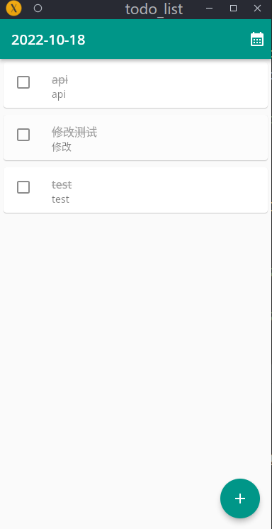
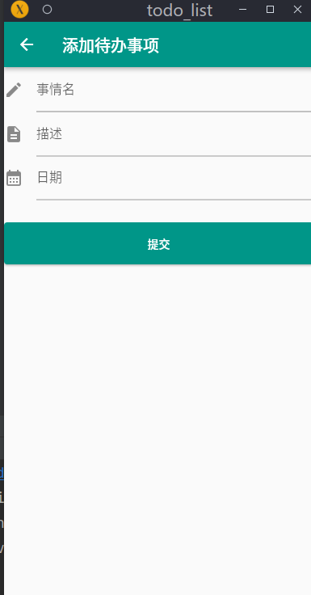
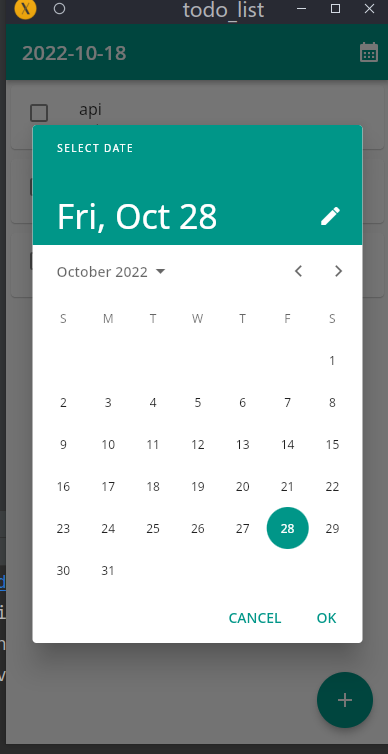

# todo_list

A Todo List Flutter project.


This is a Flutter Client.

The Flutter Server is written using Springboot.

## Getting Started

```
flutter run
```

## Example

**HomePage**



**Add a todo thing**



**Look at things to do by date**



